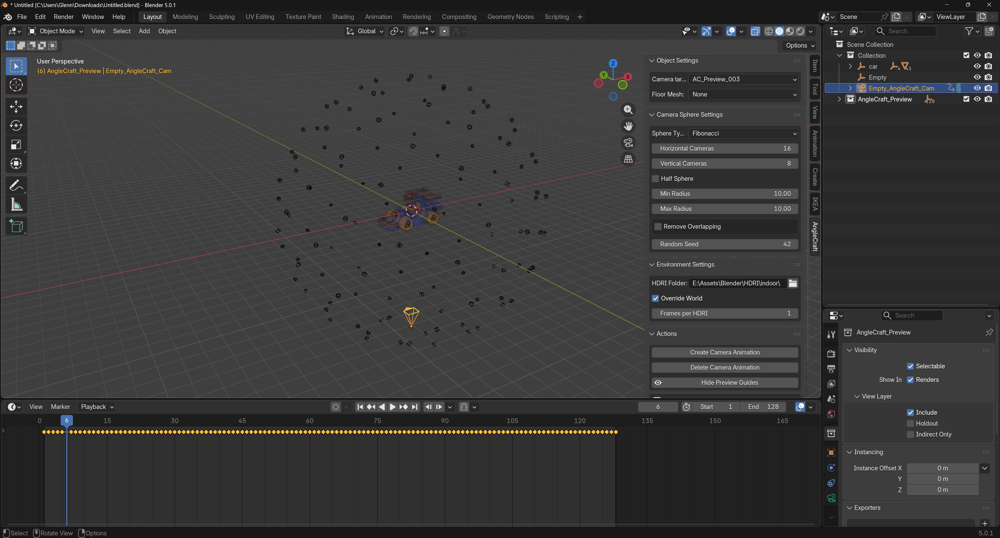
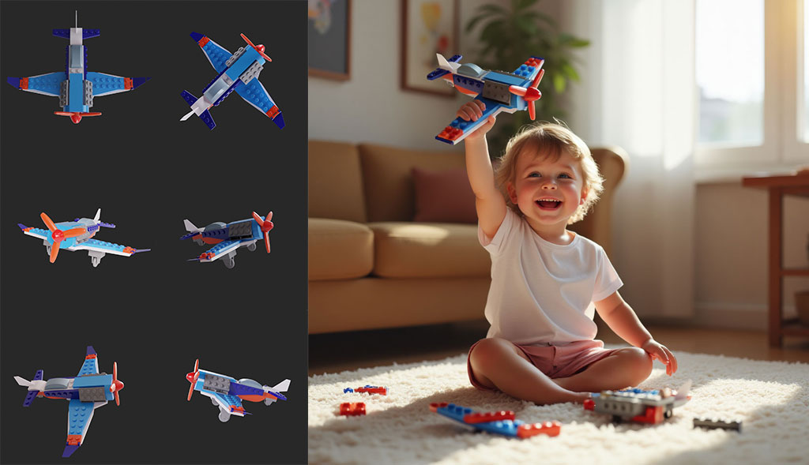
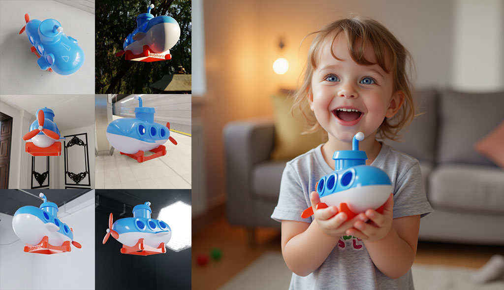

# AngleCraft

**AngleCraft** is a powerful Blender add-on designed to simplify the generation of multi-view synthetic data for AI training, 3D modeling, and various other applications. With AngleCraft, you can create sophisticated camera spheres to capture objects from multiple angles, customize render settings, and easily manage environments for seamless data creation.

This tool is ideal for generating datasets for LoRAs (Low-Rank Adaptations) in AI training but is also highly versatile, making it suitable for both AI-related and non-AI applications, such as 3D asset creation, animation, and visual effects.

## Features

### Camera Sphere & Path Generation  
Create customizable, mathematically perfect camera animations with features like:  
- Adjustable radius for precise sphere scaling.  
- Configurable horizontal and vertical camera counts.  
- Multiple distribution types:  
  - **AI Blueprint:** Configurable, exact views (Cardinals, Isometrics, Top/Bottom) optimized specifically for Image-to-Image AI models. 
  - **Linear:** Evenly spaced on axes.  
  - **Uniform:** Evenly spaced across the sphere.  
  - **Fibonacci:** Natural, pole-avoidant arrangement.  
  - **Weighted:** Upper/lower hemisphere emphasis.  
  - **Half-sphere:** Focus on targeted upper areas.  

### Global Viewport Preview  
- Instantly visualize your exact camera angles before rendering using a lightweight cloud of Empties.
- Toggle "Show/Hide Preview Guides" directly from the UI without cluttering your scene or slowing down your viewport.

### Procedural Animation Workflow  
- AngleCraft uses a single, intelligently keyframed master camera (`AngleCraft_Cam`) rather than generating dozens of static cameras. 
- Automatically hides your floor mesh when the camera dips below the horizon line.

### Dynamic Environment Setup  
- HDRI-based lighting for realistic illumination.  
- Dynamic frame-by-frame HDRI swapping: perfectly syncs environment changes to camera movements.
- Configurable pacing (e.g., change the HDRI every 1, 2, or 5 frames).
- Pre-loads HDRIs to memory to ensure absolute stability during rendering.

### Native Blender Integration  
- AngleCraft is a non-destructive scene setup tool. It relies entirely on Blender's native **Render Animation (Ctrl+F12)** and standard Output Properties, guaranteeing compatibility with your preferred render engine (Cycles, Eevee), resolution, and denoising settings.

## Dynamic Object Selection  
- **Camera Target:** - Use an empty object as the focus point.  
  - Adjust distance and positioning around the target.  
- **Floor Mesh (Optional):** - Assist in camera alignment for grounded objects.  
  - Automatically hidden from renders when the camera angle goes below it.

## Applications
AngleCraft bridges the gap between 3D scene setup and AI generation. Its highly configurable camera paths make it incredibly versatile for a variety of workflows:

- **Direct AI Blueprints (Image-to-Image):** Generate the exact orthographic, isometric, and cardinal views required by multimodal AI models like Gemini, Vizcom, Midjourney, or ControlNet. By feeding these perfectly aligned 3D reference images into the AI, you can maintain strict volume and composition while generating new concepts, material variations, and high-fidelity renders.
- **Dataset Synthesis (LoRA Training):** Synthesize massive, high-quality multi-view datasets with controlled lighting and dynamically randomized environments to train custom AI models.
- **3D Asset Presentation:** Quickly generate automated turntables, showcase renders, and standardized asset catalog images without manually moving the camera.
- **Animation & VFX:** Use the procedural mathematical paths (Fibonacci, Equator Dense, etc.) for smooth, perfectly spaced fly-arounds in your standard Blender animation projects.

## Installation

1. Go to the [Releases page](https://github.com/glenn-de-backer/anglecraft/releases) and download the latest version of the add-on.
2. Open Blender and navigate to **Edit > Preferences > Add-ons**.
3. Click **Install from Disk** and select the `.zip` file you downloaded from the releases page.
4. Enable the "AngleCraft" add-on in the preferences.
5. The "AngleCraft" tab will appear in the 3D View sidebar (press `N`).

## Usage

1. Open the **AngleCraft** tab in the 3D View sidebar.
2. Set your **Camera Target** (of type **Empty**) and optionally, set your **Floor Mesh** in the **Object Settings** panel.
3. Configure your **Camera Sphere Settings**:
    - Choose a mathematical distribution or the **AI Blueprint** mode. (The UI will dynamically adapt to show you exactly how many frames will be generated).
    - Set your radius, overlap thresholds, and random seed.
4. Adjust **Environment Settings**: 
    - Select the folder where your HDRIs are stored. Check **Override World** to allow AngleCraft to dynamically swap them during playback.
5. Under **Actions**, click **Create Camera Animation**.
6. Toggle **Show/Hide Preview Guides** to visualize your exact camera locations in the viewport.
7. **Render your Dataset**:
    - Use Blender's native **Output Properties** (the printer icon) to set your save folder, resolution, and file format.
    - Press **Ctrl+F12** (Render Animation) to generate your perfectly aligned dataset!

## Examples

### Fluxgym example

Below is an example of a dataset processed with **FluxGym** using images created with AngleCraft:

For more information on how to use these datasets for training, please check out the [FluxGym repository](https://github.com/cocktailpeanut/fluxgym).

### Vizcom example

### Gemini example

## I'd Love to Know If You're Using AngleCraft!

If you're using **AngleCraft** in your projects, I would absolutely love to hear from you! Whether you're generating data for AI, creating 3D assets, or working on animations, your feedback is invaluable. It also helps me improve the tool.

Feel free to reach out via GitHub issues, or drop me a message with your use case. If you'd like to share examples or tell me how you're using AngleCraft, that would be fantastic!

## License
This project is licensed under the **GNU General Public License v3.0 (GPLv3)**.  
You are free to use, modify, and distribute this software under the terms of the GPLv3 license. For more details, refer to the LICENSE file.

## Contributing
We welcome contributions to AngleCraft!  
Feel free to submit issues, feature requests, or pull requests to help improve this project.

## Acknowledgments
Special thanks to the Blender community for their support and inspiration.

## Donations
I am not seeking monetary compensation for this project. However, if you find AngleCraft useful, I highly encourage you to consider donating to the [Blender Foundation](https://fund.blender.org/). Your support helps ensure the continued development and improvement of Blender, a vital tool for creators worldwide.

## Contact
If you have any questions or suggestions, feel free to reach out via GitHub issues.
