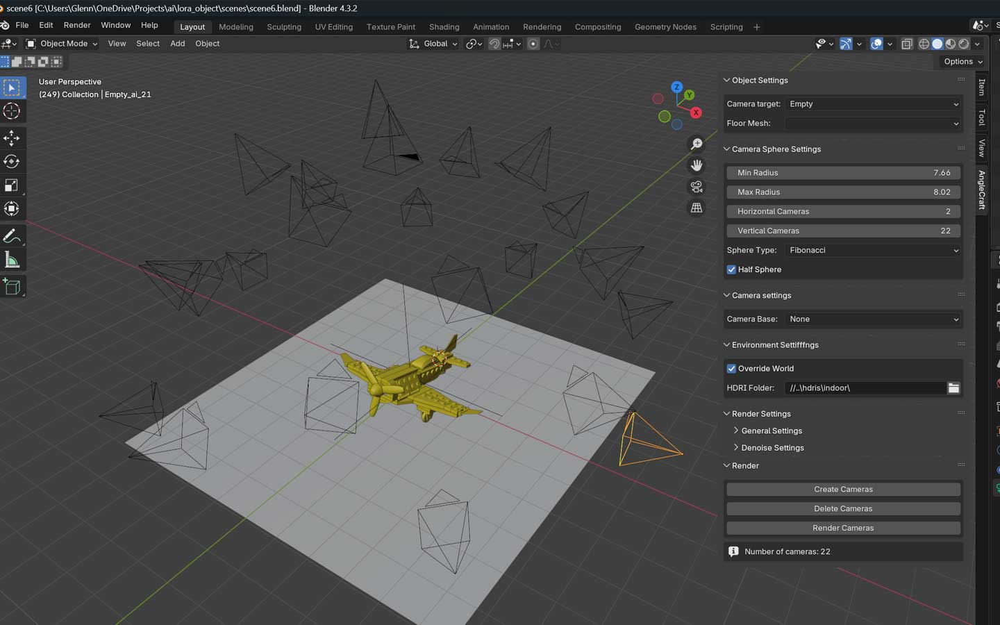
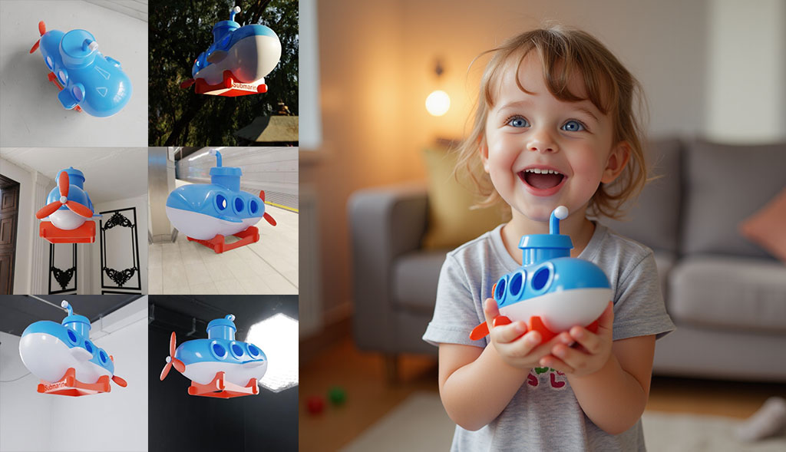

# AngleCraft

**AngleCraft** is a powerful Blender add-on designed to simplify the generation of multi-view synthetic data for AI training, 3D modeling, and various other applications. With AngleCraft, you can create sophisticated camera spheres to capture objects from multiple angles, customize render settings, and easily manage environments for seamless data creation.

This tool is ideal for generating datasets for LoRAs (Low-Rank Adaptations) in AI training but is also highly versatile, making it suitable for both AI-related and non-AI applications, such as 3D asset creation, animation, and visual effects.

## Features

## Camera Sphere Generation  
Create customizable camera spheres with features like:  
- Adjustable radius for precise sphere scaling.  
- Configurable horizontal and vertical camera counts.  
- Multiple distribution types:  
  - **Linear:** Evenly spaced on axes.  
  - **Uniform:** Evenly spaced across the sphere.  
  - **Fibonacci:** Natural, pole-avoidant arrangement.  
  - **Weighted:** Upper/lower hemisphere emphasis.  
  - **Half-sphere:** Focus on targeted areas.  

## Dynamic Object Selection  
- **Camera Target:**  
  - Use an empty object as the focus point.  
  - Adjust distance and positioning around the target.  
- **Floor Mesh (Optional):**  
  - Assist in camera alignment for grounded objects.  
  - Skip if unnecessary for your setup.  

## Camera Settings  
- Leverage an existing camera as a template:  
  - Inherit lens properties and other settings.  
  - Ensure uniformity across sphere cameras.  

## Environment Setup  
- HDRI-based lighting for realistic illumination.  
- Override options for custom lighting setups.  
- Randomize HDRIs for diverse scene variations.  
- Default to current world lighting if no HDRI is specified.  

## Render Settings  
- Define output directories for organized renders.  
- Set resolution, aspect ratio, and samples.  
- Include denoising options:  
  - **OptiX** for fast results.  
  - **Open Image Denoise** for high-quality cleanup.  

## Applications
AngleCraft is primarily designed for generating high-quality AI training datasets, focusing on creating synthetic data with controlled lighting, camera angles, and environments. While its core purpose is to support machine learning model development, it also offers versatility for a variety of other application

## Installation

1. Go to the [Releases page](https://github.com/glenn-de-backer/anglecraft/releases) and download the latest version of the add-on.
2. Open Blender and navigate to **Edit > Preferences > Add-ons**.
3. Click **Install from Disk** and select the `.zip` file you downloaded from the releases page.
4. Enable the "AngleCraft" add-on in the preferences.
5. The "AngleCraft" tab will appear in the 3D View sidebar (press `N`).

## Usage

1. Open the **AngleCraft** tab in the 3D View sidebar.
2. Set your **Camera Target** (of type **empty**) and optionally, set your **Floor Mesh** in the **Object Settings** panel.
3. Configure your **Camera Sphere Settings**, including the radius, camera count, and distribution type.
4. In the **Camera Settings** panel, you can select an existing camera to use as a base for the cameras in your sphere. The base camera will define properties such as the lens and other settings for the cameras created around the sphere.
5. Adjust **Environment Settings**, select the folder where your HDRI's are stored. If HDRI is not overridden, the current world settings will be used.
6. **Fine-tune Render Settings**:
    - Set your **output folder** where the rendered images will be stored.
    - Adjust other settings such as resolution and render samples.
7. Use the **Render Panel** to:
    - Create cameras.
    - Delete existing cameras.
    - Start rendering your multi-view data.
8. Check the output directory for rendered images.

## Training is Not Part of This Add-on

It's important to know that **AngleCraft** contains **no AI training logic**. The add-on's primary focus is on generating high-quality multi-view datasets by capturing 3D models from various angles and lighting conditions. 

The images created using AngleCraft are typically used with other tools for AI model training. One such tool I use is **[FluxGym](https://github.com/cocktailpeanut/fluxgym)**, which is designed for managing and processing datasets for AI training. **FluxGym** allows you to efficiently train models using the images generated by AngleCraft.

### Fluxgym example
Below is an example of a dataset processed with **FluxGym** using images created with AngleCraft:

For more information on how to use these datasets for training, please check out the [FluxGym repository](https://github.com/cocktailpeanut/fluxgym).

## I'd Love to Know If You're Using AngleCraft!

If you're using **AngleCraft** in your projects, I would absolutely love to hear from you! Whether you're generating data for AI, creating 3D assets, or working on animations, your feedback is invaluable. It also helps me improve the tool.

Feel free to reach out via GitHub issues, or drop me a message with your use case. If you'd like to share examples or tell me how you're using AngleCraft, that would be fantastic!

## License
This project is licensed under the **GNU General Public License v3.0 (GPLv3)**.  
You are free to use, modify, and distribute this software under the terms of the GPLv3 license. For more details, refer to the LICENSE file.

## Contributing
We welcome contributions to AngleCraft!  
Feel free to submit issues, feature requests, or pull requests to help improve this project.

## Acknowledgments
Special thanks to the Blender community for their support and inspiration.

## Donations
I am not seeking monetary compensation for this project. However, if you find AngleCraft useful, I highly encourage you to consider donating to the [Blender Foundation](https://fund.blender.org/). Your support helps ensure the continued development and improvement of Blender, a vital tool for creators worldwide.

## Contact
If you have any questions or suggestions, feel free to reach out via GitHub issues.
